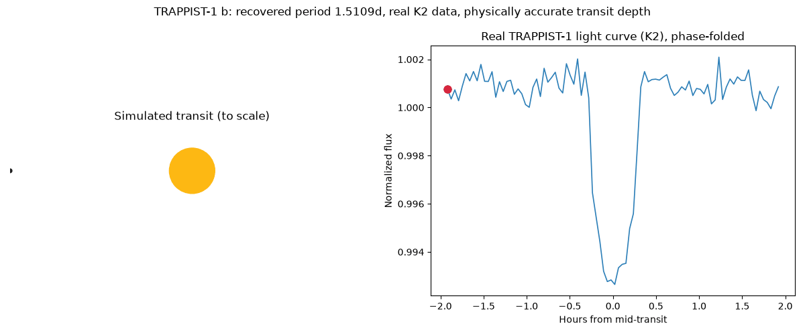

# exoplanet-transit-detection (ExoDetect)

Finding real planets in raw NASA light curves, not the pre-cleaned Kaggle set.



Left: a simulated planet crossing a simulated star, physically sized to TRAPPIST-1 b's real transit depth.
Right: the actual, detrended K2 light curve, phase-folded at the period this pipeline recovered on its own.

## What this is

Pulls raw light curves directly from the MAST archive via [`lightkurve`](https://docs.lightkurve.org/), detrends
them, and runs a classical Box Least Squares (BLS) transit search, the same method astronomers use. Three acts:

1. **Reproduce known discoveries.** Recover the orbital periods of TRAPPIST-1's seven planets, Kepler-90's eight,
   and Kepler-186's five, straight from raw K2/Kepler photometry, and check the recovered periods against the
   published catalog values.
2. **Compare BLS against a learned vetting step.** Train a small 1D CNN and a gradient-boosted classifier on real
   Kepler KOI dispositions (not the Kaggle set), then use both to vet the actual BLS detections from step 1, where
   the catalog match already tells us which detections were real.
3. **Point the same pipeline at real, unconfirmed candidates.** Run it on 25 TESS Objects of Interest still flagged
   as planet candidates, and physically characterize each one, radius, orbital distance, equilibrium temperature,
   habitable-zone verdict, with uncertainty carried through rather than presented as a single precise number.

**This pipeline flags transit-like signals. It does not confirm planets.** Confirmation requires follow-up
spectroscopy or radial-velocity data outside the scope of this project. This caveat is stated explicitly wherever
a TOI result appears, both in the code's output and in the table below.

## Results

### Validation: recovering known planets from raw data

| System | Planets recovered | Best-case error | Worst-case error (among matches) |
|---|---|---|---|
| TRAPPIST-1 | 6 of 7 | 0.002% | 0.033% |
| Kepler-90 | 6 of 8 | 0.000% | 0.006% |
| Kepler-186 | 5 of 5 | 0.001% | 0.003% |

Full per-planet table: [`docs/validation_table.csv`](docs/validation_table.csv). Every match is a direct period
recovery, no harmonics needed. The planets that were *not* recovered (TRAPPIST-1 f, Kepler-90 g and h) are reported
as misses, not hidden, most likely noise or aliasing after the stronger signals in each system were masked out
during the iterative search.

TRAPPIST-1's raw K2 photometry has real per-cadence noise of roughly ±15% (it is a faint M8 dwarf), against real
transit depths of well under 1%. BLS recovers the periods anyway by folding many transit cycles together, this is
exactly what the classical method is built for.

### BLS alone vs. BLS-plus-classifier vetting

Applied both trained classifiers to the 23 real BLS detections from the validation targets above, where the
catalog match gives ground truth for whether each detection was a real planet.

| Classifier | Agreement with ground truth | Held-out training accuracy |
|---|---|---|
| CNN (folded local view) | **69.6%** | 66.7% |
| Gradient-boosted (5 hand-engineered features) | 34.8% (worse than the 73.9% majority baseline) | 53.3% (exactly the majority baseline) |

The GBM baseline gets several *visually obvious* transits wrong, see
[`docs/figures/bls_vs_classifier_disagreements.png`](docs/figures/bls_vs_classifier_disagreements.png): three
TRAPPIST-1 planets with a clean, symmetric, unambiguous dip that it scored as unlikely. Reported as the interesting
finding it is: a CNN's learned shape representation generalized better to these specific validation targets than a
small hand-engineered feature set trained on a different random sample of KOIs.

### Discovery: 25 real, unconfirmed TESS candidates

Full table: [`docs/discovery_table.csv`](docs/discovery_table.csv).

- 25 of 25 candidates physically characterized
- 16 of 25 (64%) independently re-detected by this pipeline's own BLS search, within 1% of the catalog's published
  period, not just trusted from the catalog
- Every candidate in this batch (all under 15-day periods) comes back too hot for the habitable zone, physically
  expected for such short orbits

**None of these are confirmed planets.** They are candidates a from-scratch pipeline flagged and physically
characterized, the same first step real discovery pipelines take, not a discovery in itself.

## Method

1. **Retrieve**: raw light curves from MAST via `lightkurve`, cached locally after first download
   ([`src/exodetect/data.py`](src/exodetect/data.py))
2. **Detrend**: remove NaNs and bad quality flags, flatten with a Savitzky-Golay filter sized adaptively to each
   target's period and transit duration, sigma-clip outliers
   ([`src/exodetect/detrend.py`](src/exodetect/detrend.py))
3. **Search**: iterative Box Least Squares, astropy's `BoxLeastSquares` with a period grid built to stay
   computationally tractable across both short single-sector baselines and multi-year stitched baselines, masking
   each detection's transits before searching for the next ([`src/exodetect/bls.py`](src/exodetect/bls.py))
4. **Validate**: match recovered periods against live NASA Exoplanet Archive queries, checking small-integer
   harmonics so an alias is not mistaken for a real match
   ([`src/exodetect/catalog.py`](src/exodetect/catalog.py), [`src/exodetect/validate.py`](src/exodetect/validate.py))
5. **Classify**: fold each detection into a fixed-length local view and a set of hand-engineered vetting features
   (depth, depth-to-scatter, odd-even mismatch, secondary-eclipse depth, symmetry), train a CNN and a
   gradient-boosted baseline on real Kepler KOI dispositions
   ([`src/exodetect/fold.py`](src/exodetect/fold.py), [`src/exodetect/classifier.py`](src/exodetect/classifier.py))
6. **Characterize**: turn a transit depth into a physical planet, radius, semi-major axis, equilibrium temperature,
   habitable-zone verdict, propagating stellar parameter uncertainty through Monte Carlo sampling
   ([`src/exodetect/physics.py`](src/exodetect/physics.py))

## Repo structure

- `src/exodetect/`: the pipeline package
- `notebooks/`: one script per phase, `phase1_*` through `phase6_*`, each runnable standalone against cached data
- `docs/`: validation and discovery tables, figures, the project plan
- `data/cache/`, `data/processed/`: local caches and derived datasets (gitignored, reproducible by rerunning the
  phase scripts)

## Reproducing this

```bash
pip install -r requirements.txt
python notebooks/phase1_trappist1_pull.py   # confirm data retrieval
python notebooks/phase3_trappist1_bls.py    # BLS validation
python notebooks/phase4_build_dataset.py    # build the classifier training set (downloads ~60 targets)
python notebooks/phase4_train_models.py
python notebooks/phase5_toi_batch.py        # TOI discovery batch (downloads ~25 targets)
python notebooks/phase6_sync_animation.py
```

Light curve downloads are cached locally after the first run, MAST's search API is occasionally slow; the phase
scripts are written to tolerate a retry rather than fail outright.

## Known limitations

- **Detection is not confirmation.** Every TOI result here is a candidate flag from an independent, from-scratch
  pipeline, not a discovery. Real confirmation needs radial-velocity or spectroscopic follow-up.
- **The classifiers are trained on a small, real (unaugmented) dataset**, 60 examples. The GBM baseline does not
  clearly beat a trivial majority guess; the CNN does better but is still working with a few dozen training
  examples, nowhere near the thousands used by production vetting systems like AstroNet or the Kepler Robovetter.
- **Physical characterization assumes zero albedo** for equilibrium temperature (a standard simplifying assumption,
  documented in `physics.py`), and a simple, conservative habitable-zone boundary formula, not a full
  insolation-and-stellar-type-dependent model.
- **Stellar and planet parameter uncertainties are carried through via Monte Carlo sampling**, not analytic error
  propagation, and are only as good as the archive's own reported uncertainties.

## Citations

- NASA Exoplanet Archive, https://exoplanetarchive.ipac.caltech.edu/
- Kepler and TESS missions (NASA)
- Lightkurve Collaboration, *Lightkurve: Kepler and TESS time series analysis in Python*, JOSS, 2018.
- Kovács, Zucker, and Mazeh, *A box-fitting algorithm in the search for periodic transits*, A&A, 2002 (the BLS method)
- Shallue and Vanderburg, *Identifying Exoplanets with Deep Learning*, AJ, 2018 (the local-view folding approach)
